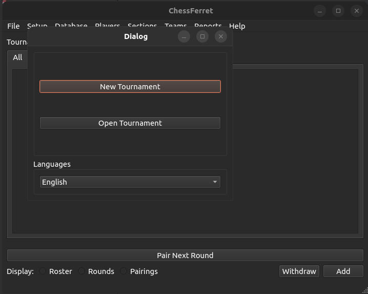
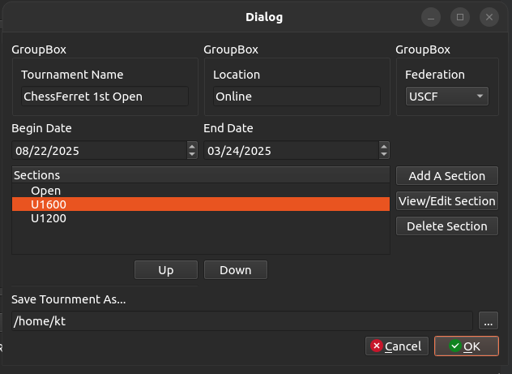
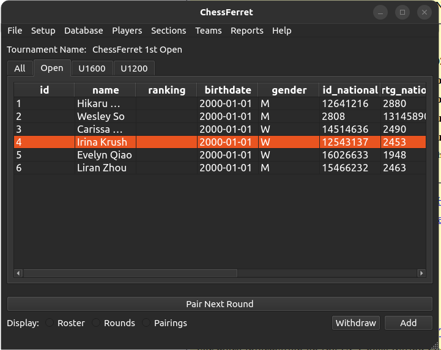

# ChessFerret

This is an open source chess management software. The project is trying to reduce the costs associated with being a Tournament Director/Arbiter, while also allowing for a completely offline management tool for linux operating systems.

## Releases
No official release is completed at this time. (STILL IN DEVELOPMENT)

## License
Licensed under GNU General Public License, Version 3
